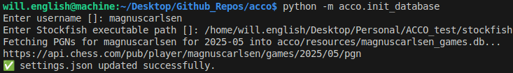
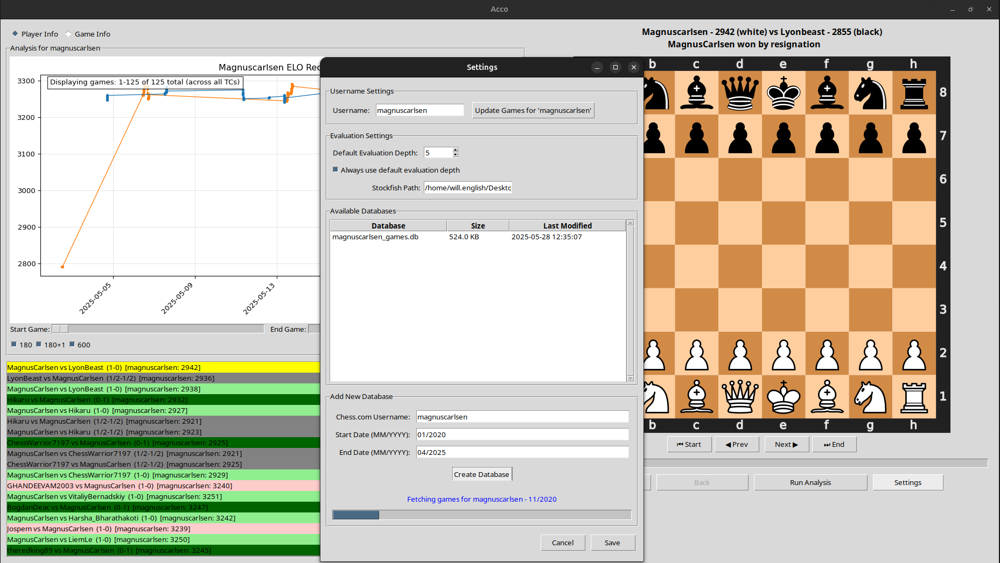

# acco 
This is a quick tool that I threw together because I was raging about cheaters on chess.com

To begin working with this repository, first clone it (here I use GitHub CLI, but you can use any method):
```
gh repo clone Dubascudes/acco
```

Next, make sure you're in the root of the project:
```
cd acco
```

Now, install the package in your python environment:
```
pip install -e .
```

Before using the software, download a copy of the [stockfish](https://stockfishchess.org/download/) engine. Unzip it, and note the path to the stockfish executable.

To begin using the software, run this line and enter your chess.com username and the stockfish path:
```
python -m acco.init_database
```




Now we can start the GUI with:
```
python -m acco.game_viewer
```


Our inital database only stores games played in the current month, so it's wise to expand this database by pulling games over a longer time span. This is done through the settings:


We now have Magnus' games going back to January of 2020. Note that our ELO plot looks pretty jank right now. We can filter it by time control using the buttons below the plot, and adjust the start and end game using the sliders:


The most useful feature is the game analysis view. When we toggle into `Game Info` by pressing the button above the ELO plot, we switch to game-analysis view. While in this view, click `Run Analysis` while any game selected (the currently selected game is colored yellow). You'll be prompted for the analysis depth stockfish should use, and when the analysis is done you will be given an Advantage plot and a WDR plot:


To move through the game, use the buttons beneath the board, or the `Turn` slider. The green dot will move along the plot, matching the state of the board:


In the evaluation tab, we can see that the next move is about to give Magnus a significant advantage- what did black play?


It would also be nice to know what black SHOULD have played, according to Stockfish. We can see the top 3 engine moves by pressing `Show Top 3`:


It looks like black didn't pick any of these. That explains (to some degree) why Magnus' position improved after this move. 

In the future, I plan on improving and expanding the analytical capabilities, including:
- T1, T2, T3 analysis (how often are top 1, 2, and 3 moves played for a player on average/in each game)
- Fix existing bugs (default analysis depth)
- Confirm Windows/Mac compatibility (I built and tested on Ubuntu)
- More robust top-3 move selection, possibly voting over 3-5 queries
- Add Lichess support
